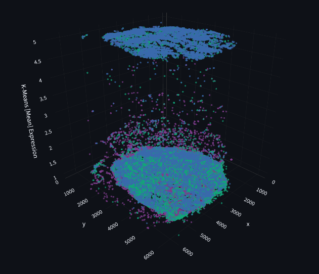

::: {.project-detail-page}

::: {.project-detail-hero .case-study-hero .cfde-case-study}
::: {.project-detail-intro}

CFDE DATA VISUALIZATION CHALLENGE · 3RD PLACE

# Spatial Biology Visualization

Interactive exploration of human lymph-node spatial data using Python, Pandas, Plotly, and Streamlit.

::: {.project-tags}
Python
Pandas
Plotly
Streamlit
HuBMAP
:::

[Launch Interactive Visualization ↗](https://cfde-data-visualization-challenge-upobkr6r29i2vbgckcrz4t.streamlit.app/){.btn .btn-primary}
[View Source Code](https://github.com/riceroni18/cfde-data-visualization-challenge){.btn .btn-outline-light}
[← Back to Projects](../index.qmd#projects){.btn .btn-outline-light}

:::
:::

::: {.project-feature-visual .cfde-feature}

{fig-alt="Interactive Streamlit dashboard visualizing spatial cellular data from a human lymph node."}

36,124 CELLS · HUMAN LYMPH NODE · INTERACTIVE 3D EXPLORATION

:::

::: {.project-detail-section .case-study-summary}

::: {.case-study-column}

THE CHALLENGE

## Making spatial biology easier to explore

Spatial datasets combine biological information with physical coordinates inside tissue, making patterns difficult to understand from tables alone.

The challenge was to turn these data into an interactive view where relationships among cell populations could be investigated visually.

:::

::: {.case-study-column}

THE RESULT

## A visual exploration environment

I worked with cell-cluster and cell-center data to prepare spatial information and build an interactive Streamlit dashboard.

The project received **3rd place** in the CFDE Data Visualization Challenge.

:::

:::

::: {.project-detail-section}

WORKFLOW

## From raw data to spatial exploration

::: {.cfde-workflow}

::: {.cfde-step}
01
Inspect -
Review structure and spatial coordinates
:::

→

::: {.cfde-step}
02
Prepare -
Clean and organize data with Pandas
:::

→

::: {.cfde-step}
03
Integrate -
Connect cell information with spatial positions
:::

→

::: {.cfde-step}
04
Explore -
Visualize interactively with Plotly + Streamlit
:::

:::
:::

::: {.project-detail-section .build-section}

WHAT I BUILT

## Translating biological coordinates into an interactive view

Using **Python and Pandas**, I organized biological and spatial data for visualization. I used **Plotly** to represent more than 36,000 cells in three-dimensional space and **Streamlit** to build and deploy an interactive interface where users can filter cellular populations and change the spatial perspective. 

::: {.project-metrics}

::: {.metric-item}
3D
spatial visualization
:::

::: {.metric-item}
4
core technologies
:::

::: {.metric-item}
3RD
challenge placement
:::

:::
:::

::: {.project-detail-section .project-evidence}

PROJECT EVIDENCE

## From spatial data to an interactive dashboard

::: {.evidence-notes}

### Data preparation
Inspected and organized cell-cluster and cell-center information before visualization.

### Spatial visualization
Mapped biological observations in three-dimensional space to explore their organization within tissue.

### Interactive application
Combined Plotly visualizations with Streamlit to create an accessible interface for exploring the spatial data.

:::

:::
:::

::: {.project-detail-section .takeaway-section}

TAKEAWAY

## Biological data becomes more useful when it becomes explorable

This project strengthened my experience working with biomedical datasets, spatial coordinates, interactive scientific visualization, and communicating complex biological information through computational tools.

[Launch the interactive dashboard →](https://cfde-data-visualization-challenge-upobkr6r29i2vbgckcrz4t.streamlit.app/){.explore-project}

[View the source code →](https://github.com/riceroni18/cfde-data-visualization-challenge){.explore-project}

:::
